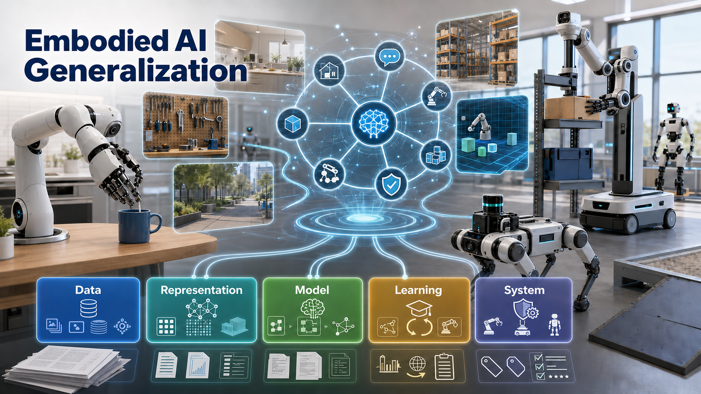

# Awesome Embodied Intelligence Generalization

> A curated paper list and taxonomy for studying **generalization in embodied intelligence**.

**English** | [中文](README_ZH.md)

  

Generalization is a central question for embodied intelligence. A robot that works only in a fixed scene, with fixed objects, fixed language, and fixed hardware is still far from reliable deployment. Real systems must handle new objects, environments, instructions, tasks, dynamics, embodiments, and the gap between simulation and the physical world.

This repository collects papers, benchmarks, and reading notes around this problem. It is not only a paper list: it organizes the literature through four research questions and a five-layer taxonomy of mechanisms, so that readers can see what kind of generalization a method claims, how it tries to obtain it, and whether the evaluation protocol actually supports the claim.

The current paper table contains **362** entries. Each paper is assigned one primary RQ2 layer for readability, while row-level tags retain finer mechanism information.

## Research Questions

| RQ | Scope |
|---|---|
| **RQ1: What is generalization in embodied intelligence?** | Generalization should be specified by axis: object, environment, language, task, skill, dynamics, embodiment, sim-to-real transfer, long-horizon execution, and safety. |
| **RQ2: How do existing methods obtain generalization?** | We organize mechanisms into data, representation, model, learning, and system layers. |
| **RQ3: What do current benchmarks actually measure?** | Benchmark scores should be interpreted by the variables they change and control, rather than as generic evidence of universal embodied capability. |
| **RQ4: What should future evaluation protocols look like?** | Evaluation should define the generalization axis, design controlled splits, test single-axis and multi-axis shifts, and report both success rates and failure modes. |

## Contents

- [RQ1: Generalization Dimensions](#rq1-generalization-dimensions)
- [RQ2: Mechanism Taxonomy](#rq2-mechanism-taxonomy)
- [RQ3: Benchmark Reading](#rq3-benchmark-reading)
- [RQ4: Evaluation Protocol](#rq4-evaluation-protocol)
- [Paper List by RQ2 Mechanism](#paper-list-by-rq2-mechanism)
  - [Data Layer](#data-layer)
  - [Representation Layer](#representation-layer)
  - [Model Layer](#model-layer)
  - [Learning Layer](#learning-layer)
  - [System Layer](#system-layer)
- [Contributing](#contributing)

## RQ1: Generalization Dimensions

In this repository, embodied generalization means the ability of an embodied agent to understand goals, choose actions, and complete tasks under conditions that were not explicitly covered during training.

| Dimension | Typical Question |
|---|---|
| Object | Can the agent handle new instances, categories, shapes, materials, or affordances? |
| Environment | Can it work under new layouts, lighting, backgrounds, clutter, occlusion, or rooms? |
| Language | Can it understand new phrasings, references, compositions, or ambiguous instructions? |
| Task | Can it solve new goals, task templates, or compositions of known subtasks? |
| Skill | Can learned behaviors be reused, ordered, composed, or adapted? |
| Dynamics | Can it remain stable when mass, friction, contact, deformation, or control frequency changes? |
| Embodiment | Can knowledge transfer across arms, grippers, dexterous hands, mobile bases, humanoids, or dual-arm systems? |
| Sim-to-Real | Can capabilities learned in simulation, offline evaluation, or synthetic data transfer to real robots? |
| Long-Horizon and Safety | Can it recover from failures, detect OOD states, use memory, and respect safety constraints? |

## RQ2: Mechanism Taxonomy

We group generalization mechanisms into five layers. The layers are not mutually exclusive, but the primary label keeps the reading list easy to scan.

| Layer | Main Role |
|---|---|
| **Data Layer** | Expands experience coverage through robot data, simulation, cross-embodiment data, human videos, and self-growing data loops. |
| **Representation Layer** | Introduces reusable structure such as geometry, physics, affordances, latent actions, skills, and task semantics. |
| **Model Layer** | Builds unified models for perception, language, world prediction, action generation, and verification. |
| **Learning Layer** | Improves policies through imitation, reinforcement learning, pretraining, transfer, test-time adaptation, and continual learning. |
| **System Layer** | Organizes capabilities through planning, memory, retrieval, skill composition, reasoning, safety checks, and recovery. |

## RQ3: Benchmark Reading

Benchmarks are evidence for generalization, not generalization itself. A benchmark is informative only when it makes clear which variables are changed, which variables are controlled, and what claims the reported score can support.

| Benchmark / Direction | Useful For | Main Caution |
|---|---|---|
| LIBERO | Language-conditioned manipulation, multi-task learning, lifelong learning | Fixed task structures may create shortcuts or overfitting. |
| CALVIN | Long-horizon language-conditioned manipulation | Protocol-specific optimization may be over-interpreted as general ability. |
| SimplerEnv | Whether simulation evaluation predicts real robot policy performance | Sim-to-real ranking agreement should be checked, not assumed. |
| RoboCasa | Household and kitchen scene diversity, object and task variation | Scene domain and data-source dependence still matter. |
| RoboTwin / RoboTwin 2.0 | Bimanual manipulation, synthetic data, embodiment diversity, sim-to-real | Simulation-real alignment remains a key variable. |
| LIBERO-Plus | Controlled perturbations over object layout, camera, language, lighting, background, and noise | Higher scores should still be tied to the tested perturbation axes. |

## RQ4: Evaluation Protocol

A generalization evaluation should move from controlled sanity checks to harder distribution shifts.

| Level | Evaluation Target |
|---|---|
| 0 | IID sanity check: verify that the model works near the training distribution. |
| 1 | Single-axis generalization: change one factor such as object, language, camera, or layout. |
| 2 | Multi-axis generalization: change several factors at once, such as new objects plus new instructions plus new layouts. |
| 3 | Dynamics and embodiment generalization: change contact, friction, payload, robot morphology, or control frequency. |
| 4 | Sim-to-real calibration: compare simulation and real-world behavior instead of reporting simulation scores alone. |
| 5 | Long-horizon and safety: evaluate recovery, memory, OOD detection, constraints, and failure modes. |

## Paper List by RQ2 Mechanism

### Data Layer

    

Generalization by broader, richer, and reusable experience coverage.

`D1` Large-scale robot experience · `D2` Simulation and synthetic data · `D3` Cross-embodiment data · `D4` Non-robot data transfer · `D5` Self-growing data loop

| Year / Venue | Paper | RQ2 Tags | Embodiment | Generalization Focus | Links |
|---|---|---|---|---|---|
| ICML 2026 | [OXE-AugE: A Large-Scale Robot Augmentation of OXE for Scaling Cross-Embodiment Policy Learning](https://icml.cc/virtual/2026/poster/64619) |     | / |  |  |
| ICML 2026 | [RoboTwin 2.0: A Scalable Data Generator and Benchmark with Strong Domain Randomization for Robust Bimanual Robotic Manipulation](https://icml.cc/virtual/2026/poster/62192) |    |   |      |    |
| ICLR 2026 | [CE-Nav: Flow-Guided Reinforcement Refinement for Cross-Embodiment Local Navigation](https://openreview.net/forum?id=apaLoTumdO) |   |  |     |  |
| ICLR 2026 | [Cross-Embodiment Offline Reinforcement Learning for Heterogeneous Robot Datasets](https://openreview.net/forum?id=GrsoLVNy3Y) |   | / |    |   |
| ICLR 2026 | [RoboCasa365: A Large-Scale Simulation Framework for Training and Benchmarking Generalist Robots](https://openreview.net/forum?id=tQJYKwc3n4) |   | / |     |  |
| ICLR 2026 | [VLBiMan: Vision-Language Anchored One-Shot Demonstration Enables Generalizable Bimanual Robotic Manipulation](https://openreview.net/forum?id=he86smZzRk) |   |   |      |  |
| RSS 2026 | [RIO: Flexible Real-Time Robot I/O for Cross-Embodiment Robot Learning](http://arxiv.org/abs/2605.11564v1) |   |    |      |  |
| ICRA 2026 | [One-Policy-Fits-All: Geometry-Aware Action Latents for Cross-Embodiment Manipulation](http://arxiv.org/abs/2603.14522v1) |   |   |   |  |
| AAAI 2026 | [Learning from Human Gaze: Human-like Robot Social Navigation in Dense Crowds](https://ojs.aaai.org/index.php/AAAI/article/view/38941) |   | / |    |  |
| AAAI 2026 | [UrbanNav: Learning Language-Guided Embodied Urban Navigation from Web-Scale Human Trajectories](https://ojs.aaai.org/index.php/AAAI/article/view/38916) |   | / |   |   |
| arXiv 2026 | [A Systematic Study of Data Modalities and Strategies for Co-training Large Behavior Models for Robot Manipulation](http://arxiv.org/abs/2602.01067v1) |     |  |      |  |
| arXiv 2026 | [AffordSim: A Scalable Data Generator and Benchmark for Affordance-Aware Robotic Manipulation](http://arxiv.org/abs/2604.11674v2) |    |  |      |  |
| arXiv 2026 | [Being-H0.5: Scaling Human-Centric Robot Learning for Cross-Embodiment Generalization](http://arxiv.org/abs/2601.12993v1) |   | / |      |  |
| arXiv 2026 | [Cross-Embodiment Robot Manipulation via a Unified Hand Action Space](http://arxiv.org/abs/2607.03570v1) |   |  |      |  |
| arXiv 2026 | [EgoScale: Scaling Dexterous Manipulation with Diverse Egocentric Human Data](https://arxiv.org/abs/2602.16710) |    |  |   |  |
| arXiv 2026 | [GR-Dexter Technical Report](https://arxiv.org/abs/2512.24210) |   |    |    |  |
| arXiv 2026 | [LACE: Latent Visual Representation for Cross-Embodiment Learning](http://arxiv.org/abs/2605.16743v1) |   |  |    |  |
| arXiv 2026 | [Learning Action Priors for Cross-embodiment Robot Manipulation](http://arxiv.org/abs/2606.26095v1) |   | / |      |  |
| arXiv 2026 | [MolmoB0T: Large-Scale Simulation Enables Zero-Shot Manipulation](http://arxiv.org/abs/2603.16861v2) |    |   |      |  |
| arXiv 2026 | [MolmoSpaces: A Large-Scale Open Ecosystem for Robot Navigation and Manipulation](http://arxiv.org/abs/2602.11337v2) |    |  |      |  |
| arXiv 2026 | [Qwen-RobotManip Technical Report: Alignment Unlocks Scale for Robotic Manipulation Foundation Models](http://arxiv.org/abs/2606.17846v2) |    |  |      |  |
| arXiv 2026 | [RoboDream: Compositional World Models for Scalable Robot Data Synthesis](http://arxiv.org/abs/2606.02577v1) |     | / |      |  |
| arXiv 2026 | [VICX: Generalizable Robot Manipulation via Video Generation and In-Context Operator Network](http://arxiv.org/abs/2606.12028v1) |   | / |      |  |
| NeurIPS 2025 | [DexFlyWheel: A Scalable and Self-improving Data Generation Framework for Dexterous Manipulation](https://arxiv.org/abs/2509.23829) |   |  |  |   |
| NeurIPS 2025 | [Embodied Crowd Counting](https://arxiv.org/abs/2503.08367) |   |  |   |  |
| NeurIPS 2025 | [Robo2VLM: Improving Visual Question Answering using Large-Scale Robot Manipulation Data](https://arxiv.org/abs/2505.15517) |  | / |   |    |
| NeurIPS 2025 | [SimWorld-Robotics: Synthesizing Photorealistic and Dynamic Urban Environments for Multimodal Robot Navigation and Collaboration](https://arxiv.org/abs/2512.10046) |    |  |      |   |
| CVPR 2025 | [MobileH2R: Learning Generalizable Human to Mobile Robot Handover Exclusively from Scalable and Diverse Synthetic Data](https://arxiv.org/abs/2501.04595) |    |    |    |   |
| CVPR 2025 | [RoboSense: Large-scale Dataset and Benchmark for Egocentric Robot Perception and Navigation in Crowded and Unstructured Environments](https://arxiv.org/abs/2408.15503) |  |  |   |   |
| CVPR 2025 | [RoboTwin: Dual-Arm Robot Benchmark with Generative Digital Twins (early version)](https://arxiv.org/abs/2409.02920) |    |  |      |    |
| ICCV 2025 | [RoboPearls: Editable Video Simulation for Robot Manipulation](https://arxiv.org/abs/2506.22756) |   | / |    |  |
| CoRL 2025 | [Gen2Act: Human Video Generation in Novel Scenarios Enables Generalizable Robot Manipulation](https://scholar.google.com/scholar?q=Gen2Act%3A+Human+Video+Generation+in+Novel+Scenarios+Enables+Generalizable+Robot+Manipulation) |  | / |  |  |
| CoRL 2025 | [GraspVLA: a Grasping Foundation Model Pre-trained on Billion-scale Synthetic Action Data](https://arxiv.org/abs/2505.03233) |    |    |      |  |
| CoRL 2025 | [Towards Embodiment Scaling Laws in Robot Locomotion](http://arxiv.org/abs/2505.05753v2) |    | / |   |  |
| IROS 2025 | [Cross-Embodiment Robotic Manipulation Synthesis via Guided Demonstrations through CycleVAE and Human Behavior Transformer](http://arxiv.org/abs/2503.08622v1) |   |   |      |  |
| arXiv 2025 | [3DFlowAction: Learning Cross-Embodiment Manipulation from 3D Flow World Model](http://arxiv.org/abs/2506.06199v1) |   | / |      |  |
| arXiv 2025 | [AnyTask: an Automated Task and Data Generation Framework for Advancing Sim-to-Real Policy Learning](http://arxiv.org/abs/2512.17853v2) |    | / |      |  |
| arXiv 2025 | [CEDex: Cross-Embodiment Dexterous Grasp Generation at Scale from Human-like Contact Representations](http://arxiv.org/abs/2509.24661v1) |   |   |      |  |
| arXiv 2025 | [HERMES: Human-to-Robot Embodied Learning from Multi-Source Motion Data for Mobile Dexterous Manipulation](http://arxiv.org/abs/2508.20085v3) |   |   |      |  |
| arXiv 2025 | [Humanoid Everyday: A Comprehensive Robotic Dataset for Open-World Humanoid Manipulation](https://arxiv.org/abs/2510.08807) |   |    |      |    |
| arXiv 2025 | [Iterative Compositional Data Generation for Robot Control](http://arxiv.org/abs/2512.10891v5) |     | / |      |  |
| arXiv 2025 | [Latent Action Diffusion for Cross-Embodiment Manipulation](http://arxiv.org/abs/2506.14608v4) |   |  |    |  |
| arXiv 2025 | [RoboMIND 2.0: A Multimodal, Bimanual Mobile Manipulation Dataset for Generalizable Embodied Intelligence](http://arxiv.org/abs/2512.24653v3) |    |    |      |  |
| arXiv 2025 | [RoboVerse: Towards a Unified Platform, Dataset and Benchmark for Scalable and Generalizable Robot Learning](http://arxiv.org/abs/2504.18904v1) |    | / |      |  |
| arXiv 2025 | [RoboWheel: A Data Engine from Real-World Human Demonstrations for Cross-Embodiment Robotic Learning](http://arxiv.org/abs/2512.02729v1) |     |    |      |  |
| arXiv 2025 | [Scaling Cross-Embodiment World Models for Dexterous Manipulation](https://arxiv.org/abs/2511.01177) |  |   |      |  |
| arXiv 2025 | [Trajectory Conditioned Cross-embodiment Skill Transfer](http://arxiv.org/abs/2510.07773v1) |    |  |     |  |
| arXiv 2025 | [UMIGen: A Unified Framework for Egocentric Point Cloud Generation and Cross-Embodiment Robotic Imitation Learning](http://arxiv.org/abs/2511.09302v1) |    | / |      |  |
| NeurIPS 2024 | [PEAC: Unsupervised Pre-training for Cross-Embodiment Reinforcement Learning](https://proceedings.neurips.cc/paper_files/paper/2024/hash/62203a74e233e933b160711e791e1a02-Abstract-Conference.html) |  | / |    |   |
| CoRL 2024 (Oral) | [RoVi-Aug: Robot and Viewpoint Augmentation for Cross-Embodiment Robot Learning](http://arxiv.org/abs/2409.03403v2) |     | / |     |  |
| ICRA 2024 | [$\mathcal{D(R,O)}$ Grasp: A Unified Representation of Robot and Object Interaction for Cross-Embodiment Dexterous Grasping](http://arxiv.org/abs/2410.01702v4) |   |  |      |  |
| ICRA 2024 | [Built Different: Tactile Perception to Overcome Cross-Embodiment Capability Differences in Collaborative Manipulation](http://arxiv.org/abs/2409.14896v2) |   |  |    |  |
| arXiv 2024 | [Cross-Embodiment Robot Manipulation Skill Transfer using Latent Space Alignment](http://arxiv.org/abs/2406.01968v1) |   |  |      |  |
| ICLR 2023 | [RT-Trajectory: Robotic Task Generalization via Hindsight Trajectory Sketches](https://arxiv.org/abs/2311.01977) |  | / |   |   |

### Representation Layer

    

Generalization by structured priors over space, physics, objects, actions, and task semantics.

`R1` Geometric spatial representation · `R2` Physical interaction representation · `R3` Object affordance representation · `R4` Action and skill representation · `R5` Task semantic representation

| Year / Venue | Paper | RQ2 Tags | Embodiment | Generalization Focus | Links |
|---|---|---|---|---|---|
| ICML 2026 | [DLO-Lab: Benchmarking Deformable Linear Object Manipulations with Differentiable Physics](https://icml.cc/virtual/2026/poster/63391) |   | / |     |  |
| ICML 2026 | [FlatLab: A Unified Methodology Framework and Simulation-Based Benchmark for Robotic Manipulation of Flat Objects](https://icml.cc/virtual/2026/poster/66662) |    | / |     |  |
| ICML 2026 | [Hydra-Nav: Object Navigation via Adaptive Dual-Process Reasoning](https://icml.cc/virtual/2026/poster/61357) |  |  |     |   |
| ICML 2026 | [Plan in Sandbox, Navigate in Open Worlds: Learning Physics-Grounded Abstracted Experience for Embodied Navigation](https://icml.cc/virtual/2026/poster/63554) |   |  |      |   |
| ICLR 2026 | [Align-Then-stEer: Adapting the Vision-Language Action Models through Unified Latent Guidance](https://openreview.net/forum?id=T3i7Ifeatk) |  | / |      |    |
| ICLR 2026 | [DexNDM: Closing the Reality Gap for Dexterous In-Hand Rotation via Joint-Wise Neural Dynamics Model](https://openreview.net/forum?id=80vjyj5o7l) |   |    |      |  |
| ICLR 2026 | [EquAct: An SE(3)-Equivariant Multi-Task Transformer for 3D Robotic Manipulation](https://openreview.net/forum?id=d1wuA8oIH0) |   | / |    |  |
| ICLR 2026 | [Exo-Plore: Exploring Exoskeleton Control Space through Human-aligned Simulation](https://openreview.net/forum?id=TmYcqOnxhN) |  |  |     |  |
| ICLR 2026 | [From Seeing to Experiencing: Scaling Navigation Foundation Models with Reinforcement Learning](https://openreview.net/forum?id=0c7nAZjyr5) |  | / |      |  |
| ICLR 2026 | [Generalizable Coarse-to-Fine Robot Manipulation via Language-Aligned 3D Keypoints](https://openreview.net/forum?id=WXFfMLyB6y) |   | / |   |   |
| ICLR 2026 | [Interaction-aware Representation Modeling With Co-Occurrence Consistency for Egocentric Hand-Object Parsing](https://openreview.net/forum?id=RYwQ0xQcAh) |     |   |     |  |
| ICLR 2026 | [Manipulation as in Simulation: Enabling Accurate Geometry Perception in Robots](https://openreview.net/forum?id=sWyX1BpeN4) |   | / |    |  |
| ICLR 2026 | [Object-Centric World Models from Few-Shot Annotations for Sample-Efficient Reinforcement Learning](https://openreview.net/forum?id=qmEyJadwHA) |    | / |   |   |
| ICLR 2026 | [On the Generalization Capacities of MLLMs for Spatial Intelligence](https://openreview.net/forum?id=DE5ZJtR4bg) |   | / |  |   |
| ICLR 2026 | [PA3FF:Learning Part-Aware Dense 3D Feature Field For Generalizable Articulated Object Manipulation](https://openreview.net/forum?id=qXfRXfAHOK) |   | / |   |   |
| ICLR 2026 | [PD$^{2}$GS: Part-Level Decoupling and Continuous Deformation of Articulated Objects via Gaussian Splatting](https://openreview.net/forum?id=W3Q2xvrZtx) |    | / |    |  |
| ICLR 2026 | [Task Tokens: A Flexible Approach to Adapting Behavior Foundation Models](https://openreview.net/forum?id=6T3wJQhvc3) |  |    |    |  |
| ICLR 2026 | [UniHM: Unified Dexterous Hand Manipulation with Vision Language Model](https://openreview.net/forum?id=cVX3VqO8BO) |   |    |     |  |
| CVPR 2026 | [GLMap: Multi-Scale Gaussian-Language Map for Zero-shot Embodied Navigation and Reasoning](https://arxiv.org/abs/2605.01736) |    |  |     |   |
| CVPR 2026 | [GraspLDP: Towards Generalizable Grasping Policy via Latent Diffusion](http://arxiv.org/abs/2602.22862v1) |     | / |      |  |
| CVPR 2026 | [Wanderland: Geometrically Grounded Simulation for Open-World Embodied AI](https://arxiv.org/abs/2511.20620) |   | / |     |   |
| ICRA 2026 | [FreeTacMan: Robot-free Human-centric Visuo-Tactile Data Collection System for Generalizable Contact-Rich Manipulation](https://opendrivelab.com/FreeTacMan) |  |    |     |  |
| AAAI 2026 | [Expand Your SCOPE: Semantic Cognition over Potential-Based Exploration for Embodied Visual Navigation](https://ojs.aaai.org/index.php/AAAI/article/view/38929) |  |  |      |  |
| AAAI 2026 | [SIAM: Towards Generalizable Articulated Object Modeling via Single Robot-Object Interaction](https://ojs.aaai.org/index.php/AAAI/article/view/38913) |  | / |   |  |
| AAAI 2026 | [Zero-Shot Robotic Manipulation via 3D Gaussian Splatting-Enhanced Multimodal Retrieval-Augmented Generation](https://ojs.aaai.org/index.php/AAAI/article/view/38936) |  | / |    |  |
| arXiv 2026 | [ABot-PhysWorld: Interactive World Foundation Model for Robotic Manipulation with Physics Alignment](http://arxiv.org/abs/2603.23376v2) |    | / |      |  |
| arXiv 2026 | [AffordGen: Generating Diverse Demonstrations for Generalizable Object Manipulation with Afford Correspondence](http://arxiv.org/abs/2604.10579v2) |     | / |     |  |
| arXiv 2026 | [CLASP: Closed-loop Asynchronous Spatial Perception for Open-vocabulary Desktop Object Grasping](http://arxiv.org/abs/2604.11320v1) |    | / |      |  |
| arXiv 2026 | [DexRepNet++: Learning Dexterous Robotic Manipulation with Geometric and Spatial Hand-Object Representations](http://arxiv.org/abs/2602.21811v1) |     |   |      |  |
| arXiv 2026 | [Dexterity-BEV: Aligning 3D World and Actions for Generalizable Robot Policies Learning](http://arxiv.org/abs/2606.02274v2) |  |  |      |  |
| arXiv 2026 | [DiT4DiT: Jointly Modeling Video Dynamics and Actions for Generalizable Robot Control](http://arxiv.org/abs/2603.10448v2) |    | / |      |  |
| arXiv 2026 | [From Seeing to Simulating: Generative High-Fidelity Simulation with Digital Cousins for Generalizable Robot Learning and Evaluation](http://arxiv.org/abs/2604.15805v1) |     | / |      |  |
| arXiv 2026 | [FTP-1: A Foundation Tactile Policy for Generalizable Robot Manipulation](https://arxiv.org/abs/2606.13102) |  |   |    |  |
| arXiv 2026 | [Genie Sim 3.0 : A High-Fidelity Comprehensive Simulation Platform for Humanoid Robot](http://arxiv.org/abs/2601.02078v3) |  |  |      |  |
| arXiv 2026 | [GRAFT: Graph-Based Affordance Transfer via Part Correspondence](http://arxiv.org/abs/2606.25241v1) |     | / |    |  |
| arXiv 2026 | [LAMP: Lift Image-Editing as General 3D Priors for Open-world Manipulation](http://arxiv.org/abs/2604.08475v2) |     | / |      |  |
| arXiv 2026 | [Learning Geometrically-Grounded 3D Visual Representations for View-Generalizable Robotic Manipulation](http://arxiv.org/abs/2601.22988v1) |  | / |      |  |
| arXiv 2026 | [LIDEA: Human-to-Robot Imitation Learning via Implicit Feature Distillation and Explicit Geometry Alignment](http://arxiv.org/abs/2604.10677v1) |    |  |     |  |
| arXiv 2026 | [Robotic Manipulation is Vision-to-Geometry Mapping ($f(v) \rightarrow G$): Vision-Geometry Backbones over Language and Video Models](http://arxiv.org/abs/2604.12908v1) |    | / |     |  |
| arXiv 2026 | [SIM1: Physics-Aligned Simulator as Zero-Shot Data Scaler in Deformable Worlds](http://arxiv.org/abs/2604.08544v2) |    | / |      |  |
| ICML 2025 | [Flow-based Domain Randomization for Learning and Sequencing Robotic Skills](https://arxiv.org/pdf/2502.01800) |   | / |   |   |
| ICML 2025 | [Pre-training Auto-regressive Robotic Models with 4D Representations](https://arxiv.org/pdf/2502.13142) |  | / |  |    |
| ICML 2025 | [STAR: Learning Diverse Robot Skill Abstractions through Rotation-Augmented Vector Quantization](https://www.arxiv.org/pdf/2506.03863) |  | / |  |   |
| NeurIPS 2025 | [C-NAV: Towards Self-Evolving Continual Object Navigation in Open World](https://arxiv.org/abs/2510.20685) |  |  |      |   |
| NeurIPS 2025 | [DexGarmentLab: Dexterous Garment Manipulation Environment with Generalizable Policy](https://arxiv.org/abs/2505.11032) |   |    |      |  |
| NeurIPS 2025 | [EfficientNav: Towards On-Device Object-Goal Navigation with Navigation Map Caching and Retrieval](https://arxiv.org/abs/2510.18546) |  |  |      |   |
| NeurIPS 2025 | [Generalizable Dexterous Grasp Generation via Contact Map Transfer](https://arxiv.org/pdf/2511.01276) |  |    |    |  |
| NeurIPS 2025 | [LabUtopia: High-Fidelity Simulation and Hierarchical Benchmark for Scientific Embodied Agents](https://arxiv.org/abs/2505.22634) |  | / |    |  |
| NeurIPS 2025 | [SonoGym: High Performance Simulation for Challenging Surgical Tasks with Robotic Ultrasound](https://arxiv.org/abs/2507.01152) |  | / |     |   |
| NeurIPS 2025 | [Touch in the Wild: Learning Fine-Grained Manipulation with a Portable Visuo-Tactile Gripper](https://arxiv.org/abs/2507.15062v1) |  |    |    |  |
| CVPR 2025 | [G3Flow: Generative 3D Semantic Flow for Pose-aware and Generalizable Object Manipulation](https://arxiv.org/abs/2411.18369) |    | / |   |   |
| CVPR 2025 | [GraphMimic: Graph-to-Graphs Generative Modeling from Videos for Policy Learning](https://cvpr.thecvf.com/virtual/2025/poster/34942) |   | / |    |   |
| CVPR 2025 | [MetaScenes: Towards Automated Replica Creation for Real-world 3D Scans](http://arxiv.org/abs/2505.02388v1) |     | / |      |  |
| CVPR 2025 | [Tartan IMU: A Light Foundation Model for Inertial Positioning in Robotics](https://openaccess.thecvf.com/content/CVPR2025/papers/Zhao_Tartan_IMU_A_Light_Foundation_Model_for_Inertial_Positioning_in_CVPR_2025_paper.pdf) |  | / |   |   |
| CVPR 2025 | [TASTE-Rob: Advancing Video Generation of Task-Oriented Hand-Object Interaction for Generalizable Robotic Manipulation](https://arxiv.org/abs/2503.11423) |   |  |     |    |
| CVPR 2025 | [Two by Two: Learning Multi-Task Pairwise Objects Assembly for Generalizable Robot Manipulation](https://arxiv.org/abs/2504.06961) |   | / |    |    |
| CVPR 2025 | [VidBot: Learning Generalizable 3D Actions from In-the-Wild 2D Human Videos for Zero-Shot Robotic Manipulation](https://arxiv.org/abs/2503.07135) |   | / |  |   |
| ICCV 2025 | [DyWA: Dynamics-adaptive World Action Model for Generalizable Non-prehensile Manipulation](https://arxiv.org/abs/2503.16806) |    | / |     |    |
| ICCV 2025 | [Moto: Latent Motion Token as the Bridging Language for Robot Manipulation](https://arxiv.org/abs/2412.04445) |  | / |   |    |
| ICCV 2025 | [VQ-VLA: Improving Vision-Language-Action Models via Scaling Vector-Quantized Action Tokenizers](https://arxiv.org/abs/2507.01016) |  | / |     |    |
| CoRL 2025 | [O$^3$Afford: One-Shot 3D Object-to-Object Affordance Grounding for Generalizable Robotic Manipulation](http://arxiv.org/abs/2509.06233v1) |    | / |      |  |
| arXiv 2025 | [$\mathbf{M^3A}$ Policy: Mutable Material Manipulation Augmentation Policy through Photometric Re-rendering](http://arxiv.org/abs/2512.01446v1) |    | / |      |  |
| arXiv 2025 | [An Real-Sim-Real (RSR) Loop Framework for Generalizable Robotic Policy Transfer with Differentiable Simulation](http://arxiv.org/abs/2503.10118v2) |    | / |      |  |
| arXiv 2025 | [Bridging Simulation and Reality: Cross-Domain Transfer with Semantic 2D Gaussian Splatting](http://arxiv.org/abs/2512.04731v1) |     | / |      |  |
| arXiv 2025 | [FUNCanon: Learning Pose-Aware Action Primitives via Functional Object Canonicalization for Generalizable Robotic Manipulation](http://arxiv.org/abs/2509.19102v2) |    | / |      |  |
| arXiv 2025 | [Generalizable Hierarchical Skill Learning via Object-Centric Representation](http://arxiv.org/abs/2510.21121v1) |    | / |      |  |
| arXiv 2025 | [GLOVER++: Unleashing the Potential of Affordance Learning from Human Behaviors for Robotic Manipulation](http://arxiv.org/abs/2505.11865v1) |  | / |      |  |
| arXiv 2025 | [HandCept: A Visual-Inertial Fusion Framework for Accurate Proprioception in Dexterous Hands](http://arxiv.org/abs/2505.08213v2) |  |  |      |  |
| arXiv 2025 | [MIND-V: Hierarchical World Model for Long-Horizon Robotic Manipulation with RL-based Physical Alignment](http://arxiv.org/abs/2512.06628v4) |    | / |      |  |
| arXiv 2025 | [NeuralTouch: Neural Descriptors for Precise Sim-to-Real Tactile Robot Control](http://arxiv.org/abs/2510.20390v2) |    |   |      |  |
| arXiv 2025 | [OmniD: Generalizable Robot Manipulation Policy via Image-Based BEV Representation](http://arxiv.org/abs/2508.11898v1) |   | / |     |  |
| arXiv 2025 | [RoboTransfer: Controllable Geometry-Consistent Video Diffusion for Manipulation Policy Transfer](http://arxiv.org/abs/2505.23171v2) |    | / |      |  |
| arXiv 2025 | [Sim-to-Real Gentle Manipulation of Deformable and Fragile Objects with Stress-Guided Reinforcement Learning](http://arxiv.org/abs/2510.25405v1) |   |  |      |  |
| arXiv 2025 | [SKIL: Semantic Keypoint Imitation Learning for Generalizable Data-efficient Manipulation](http://arxiv.org/abs/2501.14400v2) |    | / |      |  |
| arXiv 2025 | [The Unreasonable Effectiveness of Discrete-Time Gaussian Process Mixtures for Robot Policy Learning](http://arxiv.org/abs/2505.03296v2) |  | / |     |  |
| arXiv 2025 | [Toward Deployable Multi-Robot Collaboration via a Symbolically-Guided Decision Transformer](http://arxiv.org/abs/2508.13877v1) |   | / |      |  |
| CoRL 2024 | [Flow as the Cross-Domain Manipulation Interface](https://scholar.google.com/scholar?q=Flow+as+the+Cross-Domain+Manipulation+Interface) |   | / |  |  |
| arXiv 2024 | [HACMan++: Spatially-Grounded Motion Primitives for Manipulation](http://arxiv.org/abs/2407.08585v1) |     |  |      |  |
| CoRL 2023 | [General In-hand Object Rotation with Vision and Touch](https://arxiv.org/abs/2309.09979) |   |   |      |  |
| CoRL 2023 | [Touching a NeRF: Leveraging Neural Radiance Fields for Tactile Sensory Data Generation](https://proceedings.mlr.press/v205/zhong23a.html) |    |   |     |  |
| CoRL 2022 | [DexPoint: Generalizable Point Cloud Reinforcement Learning for Sim-to-Real Dexterous Manipulation](http://arxiv.org/abs/2211.09423v2) |    |  |     |  |
| CoRL 2018 | [Sim-to-Real Reinforcement Learning for Deformable Object Manipulation](https://scholar.google.com/scholar?q=Sim-to-Real+Reinforcement+Learning+for+Deformable+Object+Manipulation) |   | / |     |  |

### Model Layer

    

Generalization by unified modeling of perception, language, prediction, and action.

`M1` VLA models · `M2` Generalist robot policies · `M3` World models · `M4` Diffusion action models · `M5` Evaluator and verifier models

| Year / Venue | Paper | RQ2 Tags | Embodiment | Generalization Focus | Links |
|---|---|---|---|---|---|
| ICML 2026 | [A Generalist Pair-wise Progress Critic Model for Vision-Language-Action Robots](https://icml.cc/virtual/2026/poster/62270) |     | / |    |    |
| ICML 2026 | [Being-H0: Vision-Language-Action Pretraining from Large-Scale Human Videos](https://icml.cc/virtual/2026/poster/62813) |   |  |      |    |
| ICML 2026 | [Cross-Embodiment Robot Foundation World Models with Latent Actions](https://icml.cc/virtual/2026/poster/63978) |   | / |   |   |
| ICML 2026 | [DreamDojo: A Generalist Robot World Model from Large-Scale Human Videos](https://icml.cc/virtual/2026/poster/65193) |   | / |  |    |
| ICML 2026 | [DyGRO-VLA: Cross-Task Scaling of Vision-Language-Action Models via Dynamic Grouped Residual Optimization](https://icml.cc/virtual/2026/poster/60681) |   | / |    |    |
| ICML 2026 | [Embodied Interpretability: Linking Causal Understanding to Generalization in Vision-Language-Action Models](https://icml.cc/virtual/2026/poster/63997) |   | / |    |    |
| ICML 2026 | [Escaping the Diversity Trap in Robotic Manipulation via Anchor-Centric Adaptation](https://icml.cc/virtual/2026/poster/66510) |   | / |  |    |
| ICML 2026 | [From Abstraction to Instantiation: Learning Behavioral Representation for Vision-Language-Action Model](https://icml.cc/virtual/2026/poster/66596) |   | / |      |    |
| ICML 2026 | [Learning Task-Sufficient World Models by Synergizing Agentic Exploration and Structured Modeling](https://icml.cc/virtual/2026/poster/64209) |  | / |  |   |
| ICML 2026 | [RA-VLA: Retrieval-Augmented VLA for Test-Time Adaptation](https://icml.cc/virtual/2026/poster/60980) |   |  |   |    |
| ICML 2026 | [SCALE: Self-uncertainty Conditioned Adaptive Looking and Execution for Vision-Language-Action Models](https://icml.cc/virtual/2026/poster/66066) |    | / |     |    |
| ICML 2026 | [Spatial Memory for Out-of-Vision Manipulation in Vision-Language-Action](https://icml.cc/virtual/2026/poster/66214) |  | / |     |  |
| ICML 2026 | [VLA-ATTC: Adaptive Test-Time Compute for VLA Models with Relative Action Critic Model](https://icml.cc/virtual/2026/poster/61157) |    | / |   |    |
| ICLR 2026 | [AutoFly: Vision-Language-Action Model for UAV Autonomous Navigation in the Wild](https://arxiv.org/abs/2602.09657) |  |  |     |   |
| ICLR 2026 | [CitySeeker: How Do VLMs Explore Embodied Urban Navigation with Implicit Human Needs?](https://openreview.net/forum?id=hzf23XSDcs) |  |  |     |  |
| ICLR 2026 | [Efficient Reinforcement Learning by Guiding World Models with Non-Curated Data](https://openreview.net/forum?id=oBXfPyi47m) |  | / |   |  |
| ICLR 2026 | [Embodied Navigation Foundation Model](https://openreview.net/forum?id=kkBOIsrCXh) |  |   |     |   |
| ICLR 2026 | [Genie Envisioner: A Unified World Foundation Platform for Robotic Manipulation](https://openreview.net/forum?id=fHLtSxDFKC) |    | / |   |    |
| ICLR 2026 | [Ground Slow, Move Fast: A Dual-System Foundation Model for Generalizable Vision-Language Navigation](https://openreview.net/forum?id=GK4rznYwhn) |    |  |    |    |
| ICLR 2026 | [Hybrid Training for Vision-Language-Action Models](https://openreview.net/forum?id=IBJtOltTbx) |   | / |    |   |
| ICLR 2026 | [MemoryVLA: Perceptual-Cognitive Memory in Vision-Language-Action Models for Robotic Manipulation](https://openreview.net/forum?id=54U3XHf7qq) |    | / |      |    |
| ICLR 2026 | [OmniNav: A Unified Framework for Prospective Exploration and Visual-Language Navigation](https://openreview.net/forum?id=zGtTQTD1zu) |   |  |     |  |
| ICLR 2026 | [OpenFly: A Comprehensive Platform for Aerial Vision-Language Navigation](https://openreview.net/forum?id=OKm3w71ymP) |  |  |    |    |
| ICLR 2026 | [RIG: Synergizing Reasoning and Imagination in End-to-End Generalist Policy](https://openreview.net/forum?id=LQv9LU2Ufg) |    | / |   |  |
| ICLR 2026 | [Test-Time Mixture of World Models for Embodied Agents in Dynamic Environments](https://openreview.net/forum?id=LQD1MrnbxH) |  | / |   |  |
| ICLR 2026 | [villa-X: Enhancing Latent Action Modeling in Vision-Language-Action Models](https://openreview.net/forum?id=y5CaJb17Fn) |  | / |   |   |
| ICLR 2026 | [Vision-Language-Action Instruction Tuning: From Understanding to Manipulation](https://openreview.net/forum?id=tsxwloasw5) |    | / |   |    |
| ICLR 2026 | [VLM4VLA: Revisiting Vision-Language-Models in Vision-Language-Action Models](https://openreview.net/forum?id=tc2UsBeODW) |    | / |   |    |
| ICLR 2026 | [WholeBodyVLA: Towards Unified Latent VLA for Whole-body Loco-manipulation Control](https://openreview.net/forum?id=OCJmVjyzN7) |   |    |      |    |
| ICLR 2026 | [X-VLA: Soft-Prompted Transformer as Scalable Cross-Embodiment Vision-Language-Action Model](https://openreview.net/forum?id=kt51kZH4aG) |    | / |    |   |
| CVPR 2026 | [Cross-Hand Latent Representation for Vision-Language-Action Models](https://arxiv.org/abs/2603.10158) |  |  |   |    |
| ECCV 2026 | [VLA-JEPA: Enhancing Vision-Language-Action Model with Latent World Model](https://arxiv.org/abs/2602.10098) |   | / |   |    |
| ICRA 2026 | [OmniVLA: An Omni-Modal Vision-Language-Action Model for Robot Navigation](https://arxiv.org/abs/2509.19480) |  | / |     |    |
| ICRA 2026 | [RealMirror: A Comprehensive, Open-Source Vision-Language-Action Platform for Embodied AI](https://arxiv.org/abs/2509.14687) |  | / |     |    |
| ICRA 2026 | [The Price Is Not Right: Neuro-Symbolic Methods Outperform VLAs on Structured Long-Horizon Manipulation Tasks with Significantly Lower Energy Consumption](http://arxiv.org/abs/2602.19260v1) |   | / |      |  |
| ICRA 2026 Workshop | [Vision-Language-Action Jump-Starting for Reinforcement Learning Robotic Agents](http://arxiv.org/abs/2604.13733v2) |   |  |      |  |
| ICRA 2026 | [VLA-Reasoner: Reinforcing Robotic Reasoning and Generalization with World Model](https://arxiv.org/abs/2509.22643) |   | / |     |    |
| IROS 2026 | [Refined Policy Distillation: From VLA Generalists to RL Experts](https://arxiv.org/abs/2503.05833) |    | / |     |    |
| IROS 2026 | [The Moving Eye: Enhancing VLA Spatial Generalization via Hybrid Dynamic Data Collection](http://arxiv.org/abs/2607.02322v1) |   |  |      |  |
| AAAI 2026 | [AerialVLA: A Vision-Language-Action Model for Aerial Navigation with Online Dialogue](https://ojs.aaai.org/index.php/AAAI/article/view/38878) |  |  |      |  |
| AAAI 2026 | [DexGraspVLA: A Vision-Language-Action Framework Towards General Dexterous Grasping](https://ojs.aaai.org/index.php/AAAI/article/view/38953) |   |  |     |  |
| AAAI 2026 | [DiTEA: Mixture-of-Experts for Vision-Language-Action Model in Robotic Manipulation](https://ojs.aaai.org/index.php/AAAI/article/view/38902) |    | / |     |   |
| AAAI 2026 | [LatentVLA: Taming Latent Space for Generalizable and Long-Horizon Bimanual Manipulation](https://ojs.aaai.org/index.php/AAAI/article/view/38926) |  |   |      |  |
| AAAI 2026 | [WorldAgen: Unified State-Action Prediction with Test-Time World Model Training](https://ojs.aaai.org/index.php/AAAI/article/view/38925) |     | / |     |    |
| arXiv 2026 | [$M^2$-VLA: Boosting Vision-Language Models for Generalizable Manipulation via Layer Mixture and Meta-Skills](http://arxiv.org/abs/2604.24182v2) |   | / |      |  |
| arXiv 2026 | [AnyCamVLA: Zero-Shot Camera Adaptation for Viewpoint Robust Vision-Language-Action Models](http://arxiv.org/abs/2603.05868v1) |   | / |      |  |
| arXiv 2026 | [AnySlot: Goal-Conditioned Vision-Language-Action Policies for Zero-Shot Slot-Level Placement](http://arxiv.org/abs/2604.10432v3) |   | / |      |  |
| arXiv 2026 | [Bridging the Morphology Gap: Adapting VLA Models to Dexterous Manipulation via Intent-Conditioned Fine-Tuning](http://arxiv.org/abs/2606.12109v1) |   |   |      |  |
| arXiv 2026 | [CoRE-VLA: Towards Scalable and Robust Vision-Language-Action Modeling via Conditional Routing of Experts](http://arxiv.org/abs/2607.03693v1) |   |  |      |  |
| arXiv 2026 | [GazeVLA: Learning Human Intention for Robotic Manipulation](http://arxiv.org/abs/2604.22615v2) |   | / |      |  |
| arXiv 2026 | [GEAR-VLA: Learning Geometry-Aware Action Representations for Generalizable Robotic Manipulation](http://arxiv.org/abs/2606.08530v2) |   | / |      |  |
| arXiv 2026 | [Generalization of World Models under Environmental Variability for Vision-based Quadrotor Navigation](http://arxiv.org/abs/2606.05015v1) |   |  |     |  |
| arXiv 2026 | [Grounding Sim-to-Real Generalization in Robotic Manipulation: An Empirical Study with Vision-Language-Action Models](http://arxiv.org/abs/2603.22876v2) |    | / |      |  |
| arXiv 2026 | [HiMe: Hierarchical Embodied Memory for Long-Horizon Vision-Language-Action Control](http://arxiv.org/abs/2607.03449v1) |  | / |      |  |
| arXiv 2026 | [Improving Vision-Language-Action Model Fine-Tuning with Structured Stage and Keyframe Supervision](http://arxiv.org/abs/2606.26801v1) |  |    |      |  |
| arXiv 2026 | [Inductive Generalization for Robotic Manipulation](http://arxiv.org/abs/2606.20999v1) |    | / |      |  |
| arXiv 2026 | [InternVLA-A1.5: Unifying Understanding, Latent Foresight, and Action for Compositional Generalization](http://arxiv.org/abs/2607.04988v1) |   | / |      |  |
| arXiv 2026 | [JoyAI-RA 0.1: A Foundation Model for Robotic Autonomy](http://arxiv.org/abs/2604.20100v2) |   | / |      |  |
| arXiv 2026 | [MuseVLA: An Adaptive Multimodal Sensing Vision-Language-Action Model for Robotic Manipulation](http://arxiv.org/abs/2606.17598v1) |   |  |      |  |
| arXiv 2026 | [PrimitiveVLA: Learning Reusable Motion Primitives for Efficient and Generalizable Robotic Manipulation](http://arxiv.org/abs/2605.28634v1) |   | / |      |  |
| arXiv 2026 | [ProgressVLA: Progress-Guided Diffusion Policy for Vision-Language Robotic Manipulation](http://arxiv.org/abs/2603.27670v1) |     | / |      |  |
| arXiv 2026 | [Qwen-RobotWorld Technical Report: Unifying Embodied World Modeling through Language-Conditioned Video Generation](http://arxiv.org/abs/2606.17030v3) |      |  |      |  |
| arXiv 2026 | [Qwen-VLA: Unifying Vision-Language-Action Modeling across Tasks, Environments, and Robot Embodiments](http://arxiv.org/abs/2605.30280v2) |   | / |      |  |
| arXiv 2026 | [Retrieve-then-Steer: Online Success Memory for Test-Time Adaptation of Generative VLAs](http://arxiv.org/abs/2605.10094v2) |   | / |      |  |
| arXiv 2026 | [Scaling World Model for Hierarchical Manipulation Policies](http://arxiv.org/abs/2602.10983v2) |     | / |      |  |
| arXiv 2026 | [Skill-Aware Diffusion for Generalizable Robotic Manipulation](http://arxiv.org/abs/2601.11266v1) |  | / |      |  |
| arXiv 2026 | [Turning Video Models into Generalist Robot Policies](http://arxiv.org/abs/2605.27817v1) |   |   |      |  |
| arXiv 2026 | [Two Bridges, One Pathway: From VLMs to Generalizable VLAs with Embodied Trajectory-Coupled Data](http://arxiv.org/abs/2606.08520v1) |  | / |      |  |
| arXiv 2026 | [Unleashing More Actions via Action Compositional Training for VLA Models](http://arxiv.org/abs/2607.00351v1) |  | / |     |  |
| arXiv 2026 | [Veo-Act: How Far Can Frontier Video Models Advance Generalizable Robot Manipulation?](http://arxiv.org/abs/2604.04502v1) |    |  |     |  |
| arXiv 2026 | [Visuo-Tactile World Models for Robot Manipulation](https://arxiv.org/abs/2602.06001) |  |    |    |  |
| arXiv 2026 | [VLA-Pro: Cross-Task Procedural Memory Transfer for Vision-Language-Action Models](http://arxiv.org/abs/2605.29562v1) |  | / |      |  |
| arXiv 2026 | [What to Ignore, What to React: Visually Robust RL Fine-Tuning of VLA Models](http://arxiv.org/abs/2605.13105v1) |  | / |      |  |
| arXiv 2026 | [Worldscape-MoE: A Unified Mixture-of-Experts World Model for Scalable Heterogeneous Action Control](http://arxiv.org/abs/2607.03964v1) |     | / |      |  |
| arXiv 2026 | [WSA$_1$: a 3D-Centric World-Spatial-Action Model for Generalizable Robot Control](https://arxiv.org/abs/2607.03941) |   | / |      |  |
| NeurIPS 2025 | [4D-VLA: Spatiotemporal Vision-Language-Action Pretraining with Cross-Scene Calibration](https://arxiv.org/abs/2506.22242) |    | / |      |   |
| NeurIPS 2025 | [Blindfolded Experts Generalize Better: Insights from Robotic Manipulation and Videogames](https://arxiv.org/abs/2510.24194) |   | / |  |    |
| NeurIPS 2025 | [Distilling LLM Prior to Flow Model for Generalizable Agent’s Imagination in Object Goal Navigation](https://arxiv.org/abs/2508.09423) |   |  |      |   |
| NeurIPS 2025 | [Exploring the Limits of Vision-Language-Action Manipulation in Cross-task Generalization](https://arxiv.org/abs/2505.15660) |   | / |    |    |
| NeurIPS 2025 | [From Experts to a Generalist: Toward General Whole-Body Control for Humanoid Robots](https://arxiv.org/abs/2506.12779) |  |   |    |    |
| NeurIPS 2025 | [Knowledge Insulating Vision-Language-Action Models: Train Fast, Run Fast, Generalize Better](https://arxiv.org/abs/2505.23705) |   | / |   |   |
| NeurIPS 2025 | [VideoVLA: Video Generators Can Be Generalizable Robot Manipulators](https://openreview.net/forum?id=UPHlqbZFZB) |   |  |    |    |
| NeurIPS 2025 | [What Can RL Bring to VLA Generalization? An Empirical Study](https://arxiv.org/abs/2505.19789) |  | / |    |   |
| CVPR 2025 | [CrayonRobo: Object-Centric Prompt-Driven Vision-Language-Action Model for Robotic Manipulation](https://arxiv.org/abs/2505.02166) |   | / |      |   |
| CVPR 2025 | [MoManipVLA: Transferring Vision-language-action Models for General Mobile Manipulation](https://arxiv.org/abs/2503.13446) |   |   |   |    |
| CVPR 2025 | [RoboGround: Robot Manipulation with Grounded Vision-Language Priors](https://arxiv.org/pdf/2504.21530) |  | / |   |  |
| CVPR 2025 | [Robotic Visual Instruction](https://arxiv.org/html/2505.00693) |    | / |     |   |
| CVPR 2025 | [UniAct: Universal Actions For Enhanced Embodied Foundation Models](https://arxiv.org/abs/2501.10105) |   | / |    |    |
| ICCV 2025 | [DexVLG: Dexterous Vision-Language-Grasp Model at Scale](https://openaccess.thecvf.com/content/ICCV2025/html/He_DexVLG_Dexterous_Vision-Language-Grasp_Model_at_Scale_ICCV_2025_paper.html) |  |   |      |  |
| CoRL 2025 | [ControlVLA: Few-shot Object-centric Adaptation for Pre-trained Vision-Language-Action Models](https://arxiv.org/abs/2506.16211) |  | / |     |    |
| CoRL 2025 Workshop | [cVLA: Towards Efficient Camera-Space VLAs](http://arxiv.org/abs/2507.02190v2) |  | / |      |  |
| CoRL 2025 | [DexVLA: Vision-Language Model with Plug-In Diffusion Expert for General Robot Control](http://arxiv.org/abs/2502.05855v3) |    |   |      |  |
| ICRA 2025 | [X-MOBILITY: End-To-End Generalizable Navigation via World Modeling](https://nvlabs.github.io/X-MOBILITY/) |   | / |    |    |
| IROS 2025 Workshop | [Graph-Fused Vision-Language-Action for Policy Reasoning in Multi-Arm Robotic Manipulation](http://arxiv.org/abs/2509.07957v1) |     |    |      |  |
| RA-L 2025 | [Towards Deploying VLA without Fine-Tuning: Plug-and-Play Inference-Time VLA Policy Steering via Embodied Evolutionary Diffusion](http://arxiv.org/abs/2511.14178v2) |   | / |      |  |
| arXiv 2025 | [Act2Goal: From World Model To General Goal-conditioned Policy](http://arxiv.org/abs/2512.23541v1) |    | / |      |  |
| arXiv 2025 | [Embodiment Transfer Learning for Vision-Language-Action Models](http://arxiv.org/abs/2511.01224v1) |   |  |      |  |
| arXiv 2025 | [EvoVLA: Self-Evolving Vision-Language-Action Model](http://arxiv.org/abs/2511.16166v1) |   |  |      |  |
| arXiv 2025 | [Experiences from Benchmarking Vision-Language-Action Models for Robotic Manipulation](http://arxiv.org/abs/2511.11298v1) |   | / |      |  |
| arXiv 2025 | [ExpReS-VLA: Specializing Vision-Language-Action Models Through Experience Replay and Retrieval](http://arxiv.org/abs/2511.06202v2) |  | / |      |  |
| arXiv 2025 | [Scalable Vision-Language-Action Model Pretraining for Robotic Manipulation with Real-Life Human Activity Videos](http://arxiv.org/abs/2510.21571v1) |  |  |      |  |
| arXiv 2025 | [See Once, Then Act: Vision-Language-Action Model with Task Learning from One-Shot Video Demonstrations](http://arxiv.org/abs/2512.07582v1) |    | / |      |  |
| arXiv 2025 | [SINGER: An Onboard Generalist Vision-Language Navigation Policy for Drones](http://arxiv.org/abs/2509.18610v1) |    |  |      |  |
| arXiv 2025 | [Tenma: Robust Cross-Embodiment Robot Manipulation with Diffusion Transformer](http://arxiv.org/abs/2509.11865v1) |  | / |      |  |
| arXiv 2025 | [VLAD-Grasp: Zero-shot Grasp Detection via Vision-Language Models](http://arxiv.org/abs/2511.05791v2) |  |  |      |  |
| ICLR 2024 | [Vision-Language Foundation Models as Effective Robot Imitators](https://openreview.net/forum?id=lFYj0oibGR) |   | / |   |   |
| NeurIPS 2024 | [Make-An-Agent: A Generalizable Policy Network Generator with Behavior-Prompted Diffusion](http://arxiv.org/abs/2407.10973v4) |  |  |      |  |
| ICRA 2024 | [Towards Generalizable Vision-Language Robotic Manipulation: A Benchmark and LLM-guided 3D Policy](http://arxiv.org/abs/2410.01345v2) |  | / |      |  |
| arXiv 2024 | [VLABench: A Large-Scale Benchmark for Language-Conditioned Robotics Manipulation with Long-Horizon Reasoning Tasks](http://arxiv.org/abs/2412.18194v1) |   | / |      |  |
| CoRL 2023 | [Open-World Object Manipulation using Pre-trained Vision-Language Models](https://arxiv.org/abs/2303.00905) |   | / |     |   |
| CoRL 2023 | [RT-2: Vision-Language-Action Models Transfer Web Knowledge to Robotic Control](https://arxiv.org/abs/2307.15818) |   | / |   |    |
| CoRL 2023 | [Scaling Up and Distilling Down: Language-Guided Robot Skill Acquisition](https://arxiv.org/abs/2307.14535) |   | / |   |   |

### Learning Layer

    

Generalization by imitation, reward, pretraining, transfer, and continual adaptation.

`L1` Imitation from demonstrations · `L2` Reward and feedback learning · `L3` Pretraining for tasks · `L4` Transfer and adaptation · `L5` Continual and test-time adaptation

| Year / Venue | Paper | RQ2 Tags | Embodiment | Generalization Focus | Links |
|---|---|---|---|---|---|
| ICML 2026 | [AdaNav: Adaptive Reasoning with Uncertainty for Vision-Language Navigation](https://icml.cc/virtual/2026/poster/61535) |   |  |    |   |
| ICML 2026 | [Learning Transferable Interaction Primitives from Game Videos for Humanoids](https://icml.cc/virtual/2026/poster/65120) |  |   |     |  |
| ICML 2026 | [Scalable and General Whole-Body Control for Cross-Humanoid Locomotion](https://icml.cc/virtual/2026/poster/62003) |  |   |   |   |
| ICLR 2026 | [All-day Multi-scenes Lifelong Vision-and-Language Navigation with Tucker Adaptation](https://openreview.net/forum?id=qSak1Hjfdq) |   |  |     |  |
| ICLR 2026 | [BFM-Zero: A Promptable Behavioral Foundation Model for Humanoid Control Using Unsupervised Reinforcement Learning](https://openreview.net/forum?id=jkhl2oI0g5) |    |    |      |    |
| ICLR 2026 | [Contact-guided Real2Sim from Monocular Video with Planar Scene Primitives](https://openreview.net/forum?id=xlr3NqxUqY) |  | / |    |  |
| ICLR 2026 | [D-REX: Differentiable Real-to-Sim-to-Real Engine for Learning Dexterous Grasping](https://openreview.net/forum?id=13jshGCK9i) |  |   |      |  |
| ICLR 2026 | [D2E: Scaling Vision-Action Pretraining on Desktop Data for Transfer to Embodied AI](https://openreview.net/forum?id=TRwQND3xpt) |   | / |   |  |
| ICLR 2026 | [Disentangled Robot Learning via Separate Forward and Inverse Dynamics Pretraining](https://openreview.net/forum?id=DdrsHWobR1) |   | / |    |   |
| ICLR 2026 | [Emergent Dexterity Via Diverse Resets and Large-Scale Reinforcement Learning](https://openreview.net/forum?id=nAO9LcV7nE) |    |  |    |  |
| ICLR 2026 | [House Of Dextra : Cross-Embodied Co-Design for Dexterous Hands](https://openreview.net/forum?id=k8ovuXEQQu) |  |   |     |  |
| ICLR 2026 | [Latent Adaptation of Foundation Policies for Sim-to-Real Transfer](https://openreview.net/forum?id=yn9dzttHvT) |   | / |  |  |
| ICLR 2026 | [Learning to Grasp Anything By Playing with Random Toys](https://openreview.net/forum?id=NZDaMcpXZm) |  |    |     |  |
| ICLR 2026 | [Lifelong Embodied Navigation Learning](https://openreview.net/forum?id=PaYo96rjij) |   |  |      |  |
| ICLR 2026 | [M$^3$E: Continual Vision-and-Language Navigation via Mixture of Macro and Micro Experts](https://openreview.net/forum?id=pFh5ygjN3V) |   |  |     |  |
| ICLR 2026 | [MetaVLA: Unified Meta Co-Training for Efficient Embodied Adaptation](https://openreview.net/forum?id=E1K2Ph3LtS) |   | / |  |  |
| ICLR 2026 | [Primary-Fine Decoupling for Action Generation in Robotic Imitation](https://openreview.net/forum?id=wySMuWHmt4) |   |    |     |  |
| ICLR 2026 | [RobotArena ∞: Scalable Robot Benchmarking via Real-to-Sim Translation](https://openreview.net/forum?id=OutljIofvS) |  | / |   |  |
| ICLR 2026 | [Sim2Real VLA: Zero-Shot Generalization of Synthesized Skills to Realistic Manipulation](https://openreview.net/forum?id=H4SyKHjd4c) |  | / |    |  |
| ICLR 2026 | [Towards Bridging the Gap between Large-Scale Pretraining and Efficient Finetuning for Humanoid Control](https://openreview.net/forum?id=NEOTsyyYH7) |    |    |     |    |
| CVPR 2026 Workshop | [Efficient Sim-to-Real Transfer of World-Action Models from Synthetic Priors](http://arxiv.org/abs/2606.31101v1) |  |  |      |  |
| CVPR 2026 | [GeCo-SRT: Geometry-aware Continual Adaptation for Robotic Cross-Task Sim-to-Real Transfer](https://arxiv.org/abs/2602.20871) |   | / |    |  |
| CVPR 2026 | [VIRAL: Visual Sim-to-Real at Scale for Humanoid Loco-Manipulation](https://arxiv.org/abs/2511.15200) |  |   |     |    |
| RSS 2026 | [Betting for Sim-to-Real Performance Evaluation](http://arxiv.org/abs/2604.24018v1) |  |  |      |  |
| ICRA 2026 | [Uni-Skill: Building Self-Evolving Skill Repository for Generalizable Robotic Manipulation](http://arxiv.org/abs/2603.02623v1) |   | / |      |  |
| IROS 2026 | [TactSpace: Learning a Physics-enriched Shared Latent Space for Tactile Sim-to-Real Transfer](http://arxiv.org/abs/2606.18959v1) |  |  |      |  |
| AAAI 2026 | [Dexterous Manipulation Transfer via Progressive Kinematic-Dynamic Alignment](https://ojs.aaai.org/index.php/AAAI/article/view/38874) |  |   |      |  |
| AAAI 2026 | [GRIM: Task-Oriented Grasping with Conditioning on Generative Examples](https://ojs.aaai.org/index.php/AAAI/article/view/38873) |  |   |     |  |
| AAAI 2026 | [PanoNav: Mapless Zero-Shot Object Navigation with Panoramic Scene Parsing and Dynamic Memory](https://ojs.aaai.org/index.php/AAAI/article/view/38899) |   |  |      |  |
| AAAI 2026 | [Run, Ruminate, and Regulate: A Dual-process Thinking System for Vision-and-Language Navigation](https://ojs.aaai.org/index.php/AAAI/article/view/38954) |   |  |   |  |
| AAAI 2026 | [Steering Visuomotor Policy in Open Worlds via Cross-View Goal Alignment](https://ojs.aaai.org/index.php/AAAI/article/view/38876) |  | / |    |   |
| AAAI 2026 | [Towards Adaptive Humanoid Control via Multi-Behavior Distillation and Reinforced Fine-Tuning](https://ojs.aaai.org/index.php/AAAI/article/view/38951) |   |    |     |   |
| RA-L 2026 | [SkillPlug: Unsupervised Skill Mining for Few-Shot Adaptation in Robotic Manipulation](http://arxiv.org/abs/2607.08354v1) |     | / |      |  |
| arXiv 2026 | [ACE: Agentic Control for Embodied Manipulation via Zero-shot Workflow Reasoning](http://arxiv.org/abs/2607.04162v1) |    | / |      |  |
| arXiv 2026 | [ExoGS: A 4D Real-to-Sim-to-Real Framework for Scalable Manipulation Data Collection](http://arxiv.org/abs/2601.18629v1) |   |  |      |  |
| arXiv 2026 | [HyperSim: A Holistic Sim-To-Real Framework For Robust Robotic Manipulation](http://arxiv.org/abs/2605.26638v1) |    | / |      |  |
| arXiv 2026 | [Knowledge-Guided Manipulation Using Multi-Task Reinforcement Learning](http://arxiv.org/abs/2603.24083v1) |    | / |      |  |
| arXiv 2026 | [Large Reward Models: Generalizable Online Robot Reward Generation with Vision-Language Models](http://arxiv.org/abs/2603.16065v2) |      | / |      |  |
| arXiv 2026 | [MoE-ACT: Scaling Multi-Task Bimanual Manipulation with Sparse Language-Conditioned Mixture-of-Experts Transformers](http://arxiv.org/abs/2603.15265v1) |      |  |      |  |
| arXiv 2026 | [MOTIF: Learning Action Motifs for Few-shot Cross-Embodiment Transfer](http://arxiv.org/abs/2602.13764v1) |     | / |      |  |
| arXiv 2026 | [PriGo: Test-Time Primitive Guidance to Diffusion and Flow Policies for Adaptive Robotic Manipulation](http://arxiv.org/abs/2607.07076v1) |     | / |      |  |
| arXiv 2026 | [ProgAgent:A Continual RL Agent with Progress-Aware Rewards](http://arxiv.org/abs/2603.07784v1) |     | / |      |  |
| arXiv 2026 | [Sim-and-Human Co-training for Data-Efficient and Generalizable Robotic Manipulation](http://arxiv.org/abs/2601.19406v1) |   | / |      |  |
| arXiv 2026 | [Sim-to-Real Transfer via a Style-Identified Cycle Consistent Generative Adversarial Network: Zero-Shot Deployment on Robotic Manipulators through Visual Domain Adaptation](http://arxiv.org/abs/2601.16677v1) |   |  |      |  |
| arXiv 2026 | [Tacmap: Bridging the Tactile Sim-to-Real Gap via Geometry-Consistent Penetration Depth Map](http://arxiv.org/abs/2602.21625v2) |    |   |      |  |
| arXiv 2026 | [Task-Relevant and Irrelevant Region-Aware Augmentation for Generalizable Vision-Based Imitation Learning in Agricultural Manipulation](http://arxiv.org/abs/2603.04845v1) |  | / |    |  |
| arXiv 2026 | [Test-time Adversarial Takeover: A Real-time Hijacking Interface against Robotic Diffusion Policies](http://arxiv.org/abs/2606.10371v1) |   |  |      |  |
| arXiv 2026 | [UniManip: General-Purpose Zero-Shot Robotic Manipulation with Agentic Operational Graph](http://arxiv.org/abs/2602.13086v1) |   |  |      |  |
| arXiv 2026 | [Video2Sim2Real: Full-Stack Autonomous Dexterous Skill Acquisition from a Single Human Video](http://arxiv.org/abs/2606.08828v1) |    |  |      |  |
| arXiv 2026 | [World-Task Factorization for Robot Learning](http://arxiv.org/abs/2606.02027v1) |  | / |    |  |
| arXiv 2026 | [Zero-Shot Sim-to-Real Robot Learning: A Dexterous Manipulation Study on Reactive Catching](http://arxiv.org/abs/2605.09789v1) |   |  |      |  |
| NeurIPS 2025 | [Active Test-time Vision-Language Navigation](https://arxiv.org/abs/2506.06630) |    |  |     |    |
| NeurIPS 2025 | [Adversarial Locomotion and Motion Imitation for Humanoid Policy Learning](https://arxiv.org/abs/2504.14305) |   |   |    |    |
| NeurIPS 2025 | [DEAL: Diffusion Evolution Adversarial Learning for Sim-to-Real Transfer](https://openreview.net/forum?id=284GWLFtjU) |   | / |   |  |
| NeurIPS 2025 | [EgoBridge: Domain Adaptation for Generalizable Imitation from Egocentric Human Data](https://arxiv.org/abs/2509.19626) |   | / |  |  |
| NeurIPS 2025 | [Generalizable Domain Adaptation for Sim-and-Real Policy Co-Training](https://arxiv.org/abs/2509.18631) |   | / |   |  |
| NeurIPS 2025 | [OSVI-WM: One-Shot Visual Imitation for Unseen Tasks using World-Model-Guided Trajectory Generation](https://arxiv.org/abs/2505.20425) |  | / |   |   |
| NeurIPS 2025 | [Provable Ordering and Continuity in Vision-Language Pretraining for Generalizable Embodied Agents](https://arxiv.org/abs/2502.01218) |  | / |   |    |
| NeurIPS 2025 | [Seeing through Uncertainty: Robust Task-Oriented Optimization in Visual Navigation](https://arxiv.org/abs/2510.00441) |    |  |      |   |
| CVPR 2025 | [AffordDP: Generalizable Diffusion Policy with Transferable Affordance](https://arxiv.org/abs/2412.03142) |  | / |   |   |
| CVPR 2025 | [ManipTrans: Efficient Dexterous Bimanual Manipulation Transfer via Residual Learning](https://openaccess.thecvf.com/content/CVPR2025/html/Li_ManipTrans_Efficient_Dexterous_Bimanual_Manipulation_Transfer_via_Residual_Learning_CVPR_2025_paper.html) |  |    |      |  |
| CVPR 2025 | [Think Small, Act Big: Primitive Prompt Learning for Lifelong Robot Manipulation](https://arxiv.org/abs/2504.00420) |    | / |     |   |
| CVPR 2025 | [ZeroGrasp: Zero-Shot Shape Reconstruction Enabled Robotic Grasping](https://cvpr.thecvf.com/virtual/2025/poster/32440) |  |    |   |  |
| ICCV 2025 | [AnyBimanual: Transferring Unimanual Policy for General Bimanual Manipulation](https://arxiv.org/abs/2412.06779) |   |   |     |    |
| ICCV 2025 | [Embodied Navigation with Auxiliary Task of Action Description Prediction](https://iccv.thecvf.com/virtual/2025/poster/1984) |   |  |     |  |
| ICCV 2025 | [SAME: Learning Generic Language-Guided Visual Navigation with State-Adaptive Mixture of Experts](https://arxiv.org/abs/2412.05552) |   |  |    |   |
| CoRL 2025 (Oral) | [FetchBot: Learning Generalizable Object Fetching in Cluttered Scenes via Zero-Shot Sim2Real](http://arxiv.org/abs/2502.17894v2) |    | / |      |  |
| CoRL 2025 | [Search-TTA: A Multimodal Test-Time Adaptation Framework for Visual Search in the Wild](https://arxiv.org/abs/2505.11350) |   | / |   |    |
| CoRL 2025 | [Sim-to-Real Reinforcement Learning for Vision-Based Dexterous Manipulation on Humanoids](http://arxiv.org/abs/2502.20396v2) |     |    |      |  |
| RSS 2025 Workshop | [Robot Policy Evaluation for Sim-to-Real Transfer: A Benchmarking Perspective](http://arxiv.org/abs/2508.11117v1) |  | / |      |  |
| ICRA 2025 | [Open-Nav: Exploring Zero-Shot Vision-and-Language Navigation in Continuous Environment with Open-Source LLMs](https://sites.google.com/view/opennav/home) |   | / |    |    |
| ICRA 2025 | [Phys2Real: Fusing VLM Priors with Interactive Online Adaptation for Uncertainty-Aware Sim-to-Real Manipulation](http://arxiv.org/abs/2510.11689v2) |    | / |      |  |
| arXiv 2025 | [High-Fidelity Simulated Data Generation for Real-World Zero-Shot Robotic Manipulation Learning with Gaussian Splatting](http://arxiv.org/abs/2510.10637v1) |  | / |      |  |
| arXiv 2025 | [NVSPolicy: Adaptive Novel-View Synthesis for Generalizable Language-Conditioned Policy Learning](http://arxiv.org/abs/2505.10359v1) |   | / |      |  |
| arXiv 2025 | [Opening the Sim-to-Real Door for Humanoid Pixel-to-Action Policy Transfer](http://arxiv.org/abs/2512.01061v1) |    |  |      |  |
| arXiv 2025 | [ReBot: Scaling Robot Learning with Real-to-Sim-to-Real Robotic Video Synthesis](http://arxiv.org/abs/2503.14526v1) |   |  |      |  |
| arXiv 2025 | [TwinAligner: Visual-Dynamic Alignment Empowers Physics-aware Real2Sim2Real for Robotic Manipulation](http://arxiv.org/abs/2512.19390v1) |  | / |     |  |
| arXiv 2025 | [X-Sim: Cross-Embodiment Learning via Real-to-Sim-to-Real](http://arxiv.org/abs/2505.07096v5) |     | / |      |  |
| arXiv 2025 | [ZeroDexGrasp: Zero-Shot Task-Oriented Dexterous Grasp Synthesis with Prompt-Based Multi-Stage Semantic Reasoning](http://arxiv.org/abs/2511.13327v1) |  |  |      |  |
| ICML 2024 | [Fast-Slow Test-Time Adaptation for Online Vision-and-Language Navigation](https://proceedings.mlr.press/v235/gao24p/gao24p.pdf) |    | / |   |  |
| ICML 2024 | [SAM-E: Leveraging Visual Foundation Model with Sequence Imitation for Embodied Manipulation](http://arxiv.org/abs/2405.19586v1) |     | / |      |  |
| CVPR 2024 | [GOAT-Bench: A Benchmark for Multi-Modal Lifelong Navigation](https://openaccess.thecvf.com/content/CVPR2024/papers/Khanna_GOAT-Bench_A_Benchmark_for_Multi-Modal_Lifelong_Navigation_CVPR_2024_paper.pdf) |   | / |      |  |
| arXiv 2024 | [RAM: Retrieval-Based Affordance Transfer for Generalizable Zero-Shot Robotic Manipulation](http://arxiv.org/abs/2407.04689v1) |    | / |      |  |
| CoRL 2023 | [AdaptSim: Task-Driven Simulation Adaptation for Sim-to-Real Transfer](http://arxiv.org/abs/2302.04903v2) |    | / |      |  |
| CoRL 2023 | [Distilled Feature Fields Enable Few-Shot Language-Guided Manipulation](https://arxiv.org/abs/2308.07931) |  | / |   |    |
| arXiv 2022 | [Soft Robots Learn to Crawl: Jointly Optimizing Design and Control with Sim-to-Real Transfer](http://arxiv.org/abs/2202.04575v1) |   |   |     |  |
| CoRL 2021 | [BC-Z: Zero-Shot Task Generalization with Robotic Imitation Learning](https://arxiv.org/abs/2202.02005) |    | / |   |    |

### System Layer

    

Generalization by planning, memory, skill organization, and failure recovery.

`S1` Task decomposition and planning · `S2` Hierarchical skill composition · `S3` RAG and memory-augmented decision making · `S4` CoT-based action selection · `S5` Safety and failure recovery

| Year / Venue | Paper | RQ2 Tags | Embodiment | Generalization Focus | Links |
|---|---|---|---|---|---|
| ICML 2026 | [Decompose and Recompose: Reasoning New Skills from Existing Abilities for Cross-Task Robotic Manipulation](https://icml.cc/virtual/2026/poster/63250) |    | / |   |   |
| ICML 2026 | [SafeDec: Constrained Decoding for Safe Autoregressive Generalist Robot Navigation Policies](https://icml.cc/virtual/2026/poster/60775) |  |  |     |   |
| ICLR 2026 | [Difference-Aware Retrieval Policies for Imitation Learning](https://openreview.net/forum?id=9AA27en4go) |    | / |   |  |
| ICLR 2026 | [HWC-Loco: A Hierarchical Whole-Body Control Approach to Robust Humanoid Locomotion](https://openreview.net/forum?id=3UE3Aatcjy) |   |    |     |    |
| ICLR 2026 | [Self-Improving Loops for Visual Robotic Planning](https://openreview.net/forum?id=SzUgx5r3wy) |   | / |    |  |
| ICLR 2026 | [Verifier-free Test-Time Sampling for Vision Language Action Models](https://openreview.net/forum?id=UD4Rw8MOEK) |  | / |    |   |
| AAAI 2026 | [Autonomous Vehicle Path Planning by Searching with Differentiable Simulation](https://ojs.aaai.org/index.php/AAAI/article/view/38917) |  |  |     |  |
| AAAI 2026 | [History-Enhanced Two-Stage Transformer for Aerial Vision-and-Language Navigation](https://ojs.aaai.org/index.php/AAAI/article/view/38885) |   |  |      |  |
| AAAI 2026 | [PhyPlan: Learning to Plan Tasks with Generalizable and Rapid Physical Reasoning for Embodied Manipulation](https://ojs.aaai.org/index.php/AAAI/article/view/38900) |   | / |    |  |
| AAAI 2026 | [Real-Time Path Planning for UAVs in Windy Environments Without Computational Fluid Dynamics](https://ojs.aaai.org/index.php/AAAI/article/view/38920) |   |  |      |  |
| AAAI 2026 | [ReflexDiffusion: Reflection-Enhanced Trajectory Planning for High-lateral-acceleration Scenarios in Autonomous Driving](https://ojs.aaai.org/index.php/AAAI/article/view/38938) |   |  |    |  |
| AAAI 2026 | [RENEW: Risk- and Energy-Aware Navigation in Dynamic Waterways](https://ojs.aaai.org/index.php/AAAI/article/view/38897) |   | / |    |  |
| AAAI 2026 | [SeqWalker: Sequential-Horizon Vision-and-Language Navigation with Hierarchical Planning](https://ojs.aaai.org/index.php/AAAI/article/view/38891) |   |  |     |  |
| AAAI 2026 | [Towards Autonomous UAV Visual Object Search in City Space: Benchmark and Agentic Methodology](https://ojs.aaai.org/index.php/AAAI/article/view/38898) |   |  |      |  |
| arXiv 2026 | [Grasp-Then-Plan with Failure Attribution: A Closed Two-Stage Framework for Precise and Generalizable Robotic Manipulation](http://arxiv.org/abs/2606.03385v1) |   | / |      |  |
| arXiv 2026 | [Revisiting Embodied Chain-of-Thought for Generalizable Robot Manipulation](http://arxiv.org/abs/2606.03784v2) |  | / |     |  |
| ICML 2025 | [SAM2Act: Integrating Visual Foundation Model with a Memory Architecture for Robotic Manipulation](https://arxiv.org/abs/2501.18564) |    | / |     |   |
| ICLR 2025 | [HAMSTER: Hierarchical Action Models For Open-World Robot Manipulation](https://arxiv.org/abs/2502.05485) |  | / |   |    |
| NeurIPS 2025 | [UniDomain: Pretraining a Unified PDDL Domain from Real-World Demonstrations for Generalizable Robot Task Planning](https://arxiv.org/abs/2507.21545) |   | / |    |  |
| CVPR 2025 | [CoT-VLA: Visual Chain-of-Thought Reasoning for Vision-Language-Action Models](https://cvpr.thecvf.com/virtual/2025/poster/33233) |   | / |     |   |
| ICCV 2025 | [RoboTron-Nav: A Unified Framework for Embodied Navigation Integrating Perception, Planning, and Prediction](https://arxiv.org/abs/2503.18525) |   |  |      |   |
| ICCV 2025 | [SD2Actor: Continuous State Decomposition via Diffusion Embeddings for Robotic Manipulation](https://iccv.thecvf.com/virtual/2025/poster/1571) |  | / |   |   |
| arXiv 2025 | [A Cross-Environment and Cross-Embodiment Path Planning Framework via a Conditional Diffusion Model](http://arxiv.org/abs/2510.19128v1) |    |  |      |  |
| ECCV 2024 | [DISCO: Embodied Navigation and Interaction via Differentiable Scene-Conditioned Options](https://arxiv.org/pdf/2407.14758) |  | / |    |  |
| arXiv 2024 | [XMoP: Whole-Body Control Policy for Zero-shot Cross-Embodiment Neural Motion Planning](http://arxiv.org/abs/2409.15585v2) |   |   |      |  |
| CVPR 2023 | [Adaptive Zone-Aware Hierarchical Planner for Vision-Language Navigation](https://openaccess.thecvf.com/content/CVPR2023/papers/Gao_Adaptive_Zone-Aware_Hierarchical_Planner_for_Vision-Language_Navigation_CVPR_2023_paper.pdf) |   | / |    |  |
| CoRL 2023 | [Reasoning Tuning Grasp: Adapting Multi-Modal Large Language Models for Robotic Grasping](https://openreview.net/forum?id=3mKb5iyZ2V) |  |   |     |  |

## Contributing

Contributions are welcome through Issues or Pull Requests. For a new paper, please provide the title, venue or year, paper link, project or code link if available, suggested RQ2 tags, the main generalization dimensions, and a short note explaining why it belongs in this list.

We especially welcome corrections to taxonomy boundaries, paper labels, benchmark claims, missing links, and newly accepted work related to embodied generalization.
